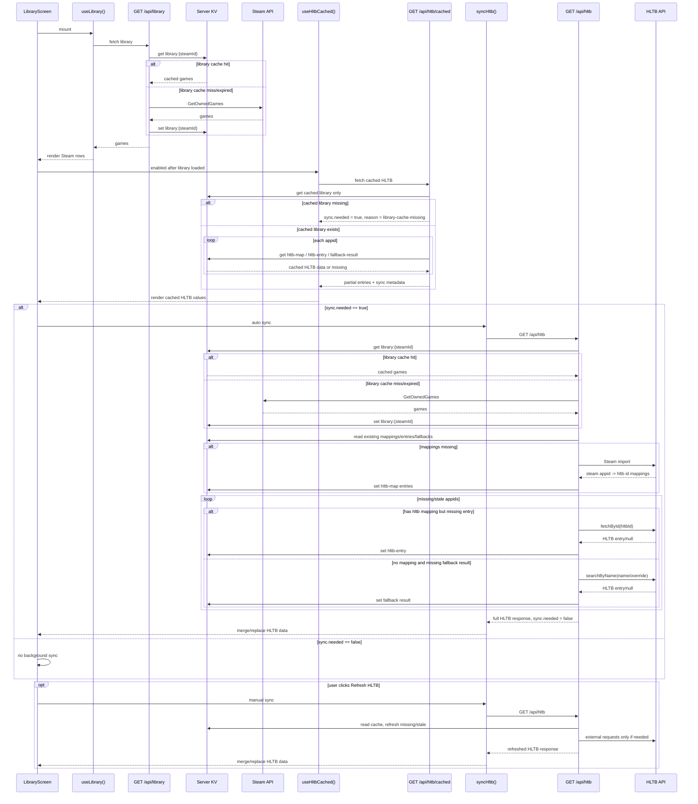

# HLTB Cached Endpoint - Design Spec

**Date:** 2026-05-27
**Status:** Approved (brainstorm)
**Author:** brainstorming session

## 1. Summary

Add a fast read-only `GET /api/hltb/cached` endpoint that returns only HLTB data already present in the server cache. The existing `GET /api/hltb` remains the synchronization endpoint that may call Steam and HLTB, fill missing cache entries, and return refreshed results.

This separates "show what we already know" from "perform slow enrichment" so a new device can render the library table quickly while missing HLTB data syncs afterward.

## 2. Goals

- Make first load on a new device fast when the server already has usable cached HLTB data.
- Ensure `GET /api/hltb/cached` never calls external Steam or HLTB APIs.
- Let the client automatically run `GET /api/hltb` when cached data reports that synchronization is needed.
- Keep the manual Refresh HLTB button as another trigger for the same sync path.
- Preserve visible cached HLTB values while sync is running.
- Return enough sync metadata for the UI and tests to know why a sync is needed.

## 3. Non-Goals

- Synchronizing browser `localStorage` between devices.
- Adding background jobs or scheduled cache warmers.
- Replacing the existing server-owned `/api/hltb` model.
- Changing Steam library refresh semantics beyond avoiding live Steam calls from the cached endpoint.

## 4. API Contracts

### `GET /api/hltb/cached`

Returns the current user's cached HLTB data for the cached Steam library.

Hard rule: this endpoint reads only server KV. It must not call:

- Steam `GetOwnedGames`;
- HLTB Steam import;
- HLTB detail lookup by id;
- HLTB name search.

Response:

```ts
type HltbSyncMeta = {
  needed: boolean
  reason:
    | 'none'
    | 'library-cache-missing'
    | 'missing-hltb-data'
    | 'stale-hltb-data'
  missingAppids: number[]
  staleAppids: number[]
  cachedCount: number
  totalCount: number
}

type HltbResponse = {
  entries: Record<number, HltbEntry | null>
  cachedAt: Record<number, string | null>
  meta: Record<number, HltbMeta>
  sync: HltbSyncMeta
}
```

If the cached Steam library is missing or expired, return an empty HLTB payload with:

```ts
sync: {
  needed: true,
  reason: 'library-cache-missing',
  missingAppids: [],
  staleAppids: [],
  cachedCount: 0,
  totalCount: 0,
}
```

This keeps `/api/hltb/cached` fast even when Steam is slow or unavailable.

### `GET /api/hltb`

Keeps the existing role as the full sync endpoint.

It may:

- load the Steam library through the existing server helper;
- call HLTB Steam import when mapping refresh policy requires it;
- call HLTB detail lookup for missing mapped entries;
- call fallback HLTB name search when no mapping exists;
- write mappings, entries, fallback results, and snapshots to KV.

After a successful full sync for the current library, it should return:

```ts
sync: {
  needed: false,
  reason: 'none',
  missingAppids: [],
  staleAppids: [],
  cachedCount: totalCount,
  totalCount,
}
```

Partial HLTB failures still return per-row `null` entries instead of failing the whole batch. Explicitly cached `null` results count as cached final state.

## 5. When `sync.needed` Is True

`sync.needed` means the cached endpoint could not assemble final HLTB state for the currently cached Steam library.

It is true when any of these are true:

- the server has no usable cached Steam library;
- an appid has no global mapping and no valid cached fallback result;
- an appid has a global mapping, but its `hltb-entry:hltb-id:{hltbId}` entry is missing;
- a required mapping, entry, or fallback result is stale by TTL policy.

It is false when every appid has one of these final cached states:

- a valid HLTB entry;
- an explicitly cached `null` result meaning no HLTB match was found;
- a valid fallback cache result for an unmapped appid.

## 6. Data Ownership

The existing shared mapping and entry caches remain authoritative:

- `hltb-map:steam-app:{appid}`
- `hltb-entry:hltb-id:{hltbId}`
- `hltb-override-name:{steamId}:{appid}`
- `hltb-library-snapshot:{steamId}`

Add a fallback-result cache for unmapped rows:

```ts
type HltbFallbackResult = {
  appid: number
  searchName: string
  entry: HltbEntry | null
  source: 'override-name' | 'steam-name' | 'none'
}
```

Suggested key:

```txt
hltb-fallback-result:{steamId}:{appid}
```

The fallback key is user-scoped because override names are user-scoped. The implementation can later add a secondary normalized-name cache, but the first version should keep ownership simple and avoid accidentally sharing fuzzy matches globally.

## 7. Client Flow

1. `useLibrary()` calls `GET /api/library`.
2. The table renders Steam rows as soon as the library is available.
3. `useHltbCached()` calls `GET /api/hltb/cached`.
4. The table renders cached HLTB values immediately.
5. If `sync.needed === true`, the client automatically starts `GET /api/hltb`.
6. The Refresh HLTB button also starts `GET /api/hltb`, regardless of `sync.needed`.
7. During sync, cached values stay visible; only missing/stale HLTB cells show loading.
8. When sync finishes, the UI merges or replaces HLTB data with the full response.

Use separate query identities for cached and sync requests, but expose one derived HLTB state to the table.

```ts
const HLTB_CACHED_QUERY_KEY = ['hltb', 'cached'] as const
const HLTB_SYNC_QUERY_KEY = ['hltb', 'sync'] as const
```

## 8. Sequence Diagram



## 9. Error Handling

- Authentication failures return `401`.
- Missing cached library in `/api/hltb/cached` returns `200` with `sync.needed = true`, not an error.
- KV read failures in `/api/hltb/cached` should be logged and treated as missing cached data for that row.
- External HLTB failures remain isolated per row in `/api/hltb`.
- Sync failure should show a toast while preserving cached values already rendered.

## 10. Test Strategy

- Route test: `GET /api/hltb/cached` does not call Steam or HLTB client functions.
- Route test: missing library cache returns `sync.needed = true` with `reason = 'library-cache-missing'`.
- Resolver test: mapping plus cached entry returns `needed = false`.
- Resolver test: mapping without cached entry returns `needed = true` and includes the appid in `missingAppids`.
- Resolver test: unmapped appid with cached fallback `null` returns `needed = false`.
- Resolver test: unmapped appid without fallback result returns `needed = true`.
- Client test: cached values render before sync completes.
- Client test: auto sync starts when cached response has `sync.needed = true`.
- Client test: Refresh HLTB starts sync even when `sync.needed = false`.
- Client test: cached table values are not cleared while sync is pending.

## 11. Planning Decisions

- Use a separate `/api/hltb/cached` route instead of `?cacheFirst=1`.
- Auto sync and manual Refresh HLTB both use the existing `/api/hltb` sync route.
- The cached endpoint must not live-load Steam library data; it reads cached library only.
- Explicitly cached `null` HLTB results are final cached state and must not cause endless sync.
